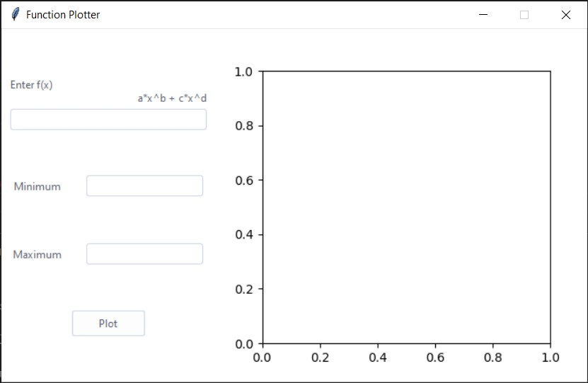
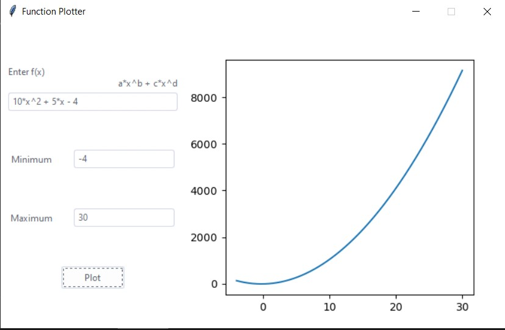
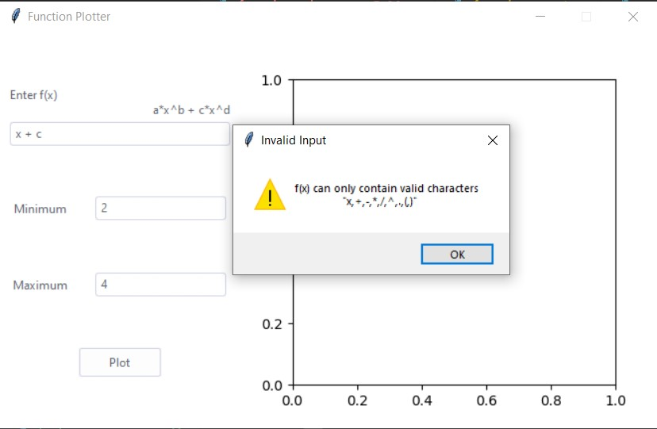
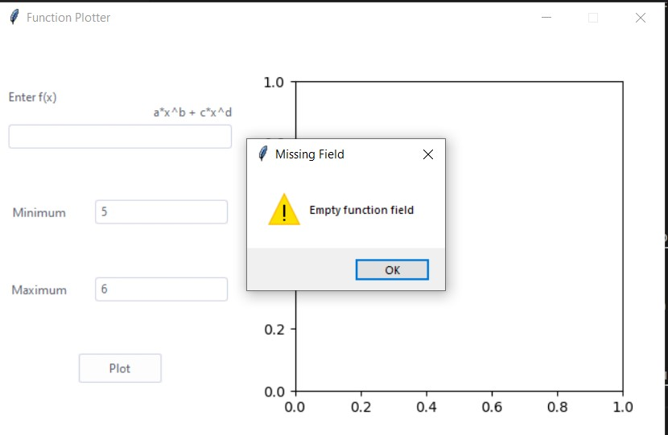
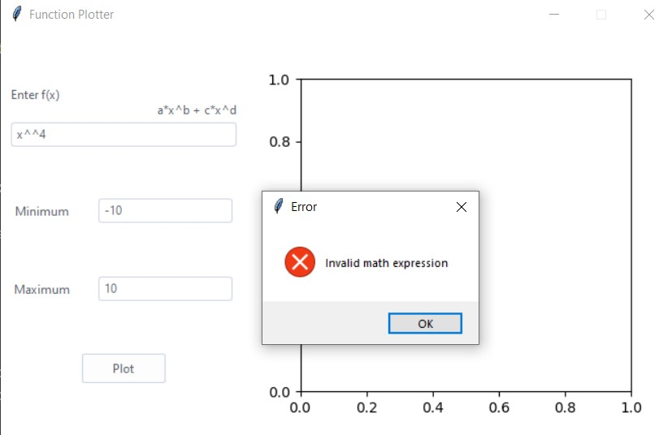
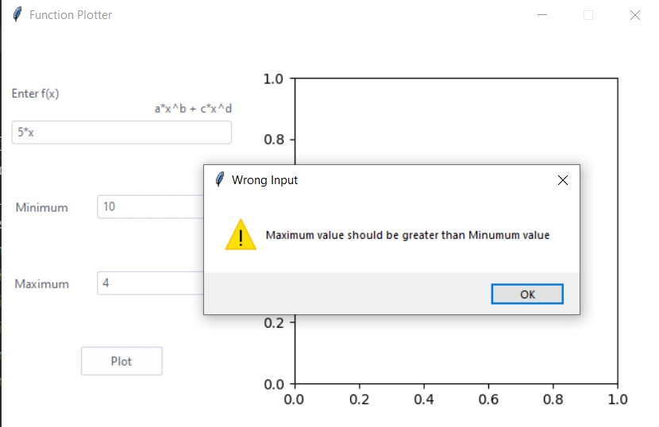

# Function_Plotter
This program is a GUI build using Tkinter.
It is used to plot functions of x entered by the user.

## Instructions
1. The user should input f(x) in the form:
 a*x^b + c*x
where 'a' and 'b' are constants.

2. The user should then enter the minumum and maximum values of x and click plot.

* The only supported characters in the function field are 
+, -, *, /, ^, (, ) and x.

* Don't leave any fields empty.

## Snapshots
1. Program main window.

2. Happy scenario.

3. Invalid characters in function field.

4. Missing field warning.

5. Invalid mathematical expression.

6. Maximum value is less than or equal Minimum value

 
 
